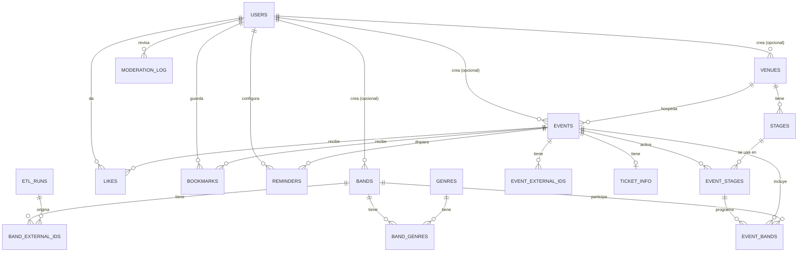

# Diseño de Base de Datos — Agenda Metal Colaborativa

Motor: **PostgreSQL 15+**. Este documento acompaña al archivo `schema.sql` con el DDL ejecutable.

---

## 1. Diagrama Entidad-Relación

_Nota: `MODERATION_LOG` referencia de forma polimórfica a `bands`, `venues` o `events` mediante `entity_type` + `entity_id` (sin FK física; ver sección 3)._

---

## 2. Diccionario de datos (resumen por tabla)

|Tabla|Propósito|
|---|---|
|`users`|Cuentas de usuario, rol (usuario/moderador/administrador)|
|`bands`|Catálogo homologado de bandas|
|`band_external_ids`|Mapeo banda interna ↔ IDs externos (Metal Archives, Metal Storm, Bandsintown)|
|`genres` / `band_genres`|Catálogo de géneros y relación M:N con bandas|
|`venues`|Catálogo de recintos/venues|
|`stages`|Escenarios físicos de un venue (persisten entre ediciones del evento)|
|`event_stages`|Qué escenarios activa una edición concreta del evento, con nombre de patrocinador y orden de grilla|
|`events`|Conciertos y festivales|
|`event_external_ids`|Mapeo de eventos con IDs externos (ej. Bandsintown event id)|
|`event_bands`|Line-up: banda, escenario y horario dentro de un evento|
|`ticket_info`|Precio y enlace externo de compra por evento|
|`likes` / `bookmarks`|Interacción social del usuario con eventos|
|`reminders`|Configuración y envío de recordatorios|
|`moderation_log`|Auditoría de decisiones de moderación|
|`etl_runs`|Trazabilidad de ejecuciones del proceso de scraping|

---

## 3. Decisiones de diseño clave

1. **Moderación como campo de estado, no como tabla separada por entidad.** `bands`, `venues` y `events` comparten el mismo patrón: `status` (`pendiente`/`aprobado`/`rechazado`), `created_by`, `reviewed_by`, `reviewed_at`. Esto evita duplicar lógica de moderación en tres módulos distintos.
    
2. **`moderation_log` es polimórfico por convención de aplicación, no por FK de base de datos.** PostgreSQL no soporta FKs polimórficas nativas; `entity_type` + `entity_id` se validan a nivel de aplicación (o con un `CHECK` + trigger si se requiere integridad estricta). Alternativa más rígida: tres tablas de log (`band_moderation_log`, `venue_moderation_log`, `event_moderation_log|) — se prefiere la versión unificada por simplicidad de auditoría global, pero se documenta el trade-off.
    
3. **Homologación de IDs externos en tabla separada (`band_external_ids`, `event_external_ids`)** en vez de columnas `metal_archives_id`, `metal_storm_id`, etc. en la tabla principal. Esto permite agregar nuevas fuentes sin migrar el esquema, y soporta el caso donde una banda tiene múltiples IDs de la misma fuente (raro, pero posible por errores de datos).
    
4. **`source_type` (`etl` / `manual`) en `bands` y `events`** para distinguir contenido que llegó por scraping vs. aportado por la comunidad — útil para reportes y para decidir si aplica auto-publicación (RF-19).
    
5. **Escenarios como entidades propias (`stages` + `event_stages`), no como texto libre.** Al revisar cómo apps de festivales reales (Wacken, y agregadores tipo festivalpilot) manejan esto, se identificó que:
    
    - El escenario físico (`stages`) pertenece al **venue** y persiste entre ediciones (el lugar no cambia, aunque cambie el nombre por patrocinio).
    - Cada edición del evento (`event_stages`) puede darle un nombre de patrocinador distinto (ej. "Jägermeister Stage") y define el orden de columnas del timetable.
    - Esto habilita mapas con coordenadas por escenario (no solo por venue) y **detección de choques de horario**— se agregó una restricción `EXCLUDE` (GiST) que impide que dos bandas queden agendadas al mismo tiempo en el mismo escenario, algo que un festival físico nunca podría tener.
    - `event_bands` referencia `event_stage_id` en vez de un campo `stage` de texto libre.
6. **`event_bands` como tabla de asociación enriquecida** (no solo M:N simple) porque necesita horario, escenario y orden de cartel por banda, requisito explícito (RF-11).
    
7. **`ticket_info` en tabla separada 1:1 con `events`** en vez de columnas dentro de `events`, para mantener `events` enfocada en datos del evento y permitir extensión futura (ej. múltiples tipos de boleto) sin romper el esquema.
    
8. **Slugs (`slug`) únicos en `bands`, `venues`, `events`** para URLs amigables (`/bandas/gojira`, `/eventos/hell-and-heaven-2027`), generados en aplicación al crear/aprobar el registro.
    
9. **Búsqueda de texto**: se recomienda un índice `GIN` con `pg_trgm` sobre `bands.name` y `events.name` para autocompletado/búsqueda difusa, tanto en el frontend como en el motor de homologación de IDs (RF-04).
    
10. **Recordatorios desacoplados de canal**: `reminders` tiene una fila por canal (email/push) en vez de columnas booleanas, para permitir agregar canales (ej. SMS) sin migración.
    
11. **Zonas horarias**: todos los timestamps se almacenan en `timestamptz` (UTC); la hora local del evento se resuelve con la zona horaria del venue (columna `timezone` en `venues`, formato IANA ej. `America/Mexico_City`).
    

---

## 4. Índices recomendados (más allá de PK/FK)

- `events(start_date)` — listados por fecha
- `events(status)` — filtrar contenido pendiente en panel de moderación
- `events(venue_id)`
- `event_stages(event_id)` — cargar los escenarios activos de una edición para renderizar la grilla
- `bands(status)`
- `venues(city)`
- `band_external_ids(source, external_id)` — UNIQUE, usado en el matching del ETL
- `event_external_ids(source, external_id)` — UNIQUE
- `likes(event_id)`, `bookmarks(event_id)` — conteos rápidos para "más populares"
- `reminders(event_id, sent_at)` — el worker de recordatorios consulta pendientes por enviar
- Índice `GIN` + `pg_trgm` en `bands(name)` y `events(name)` para búsqueda difusa

---

Ver `schema.sql` para el DDL completo, ejecutable directamente en PostgreSQL.