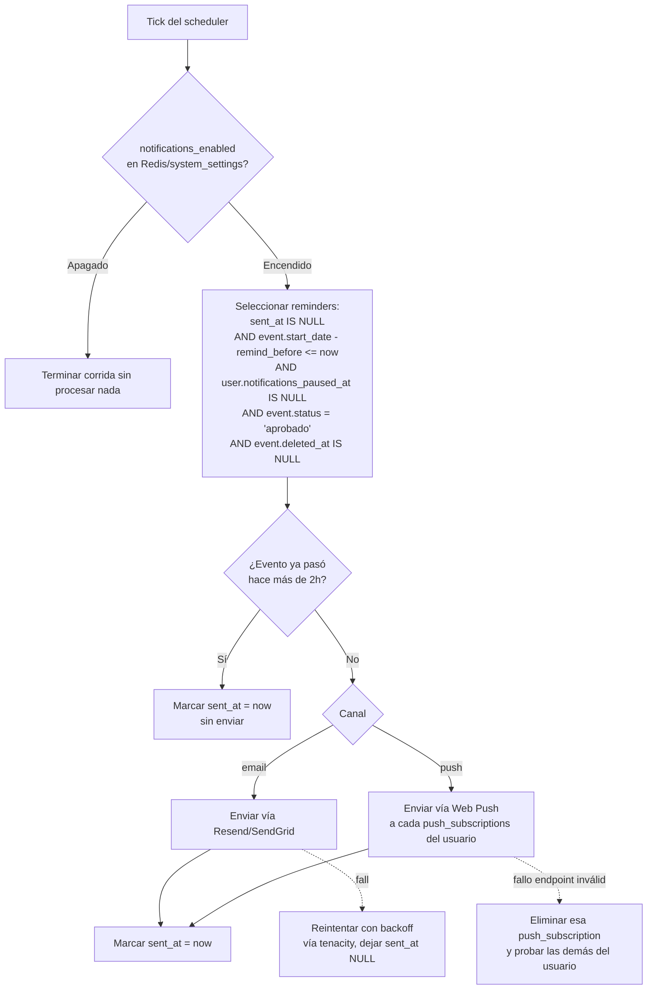

# Diseño del Módulo de Recordatorios

Cubre RF-15. Implementado como worker Python/Celery (mismo servicio que el ETL, tarea programada independiente) + endpoints de gestión en la API NestJS.

---

## 1. Alcance y requerimiento agregado

- RF-15 (ya definido): recordatorios configurables (email y/o push) con antelación configurable por evento marcado.
- **RF-15b (nuevo)**: el sistema debe contar con dos interruptores independientes que detienen el envío de notificaciones sin borrar la configuración de cada recordatorio:
    1. **Interruptor global del sistema** (Administrador): pausa el envío de _todas_ las notificaciones a _todos_ los usuarios — pensado para incidentes (proveedor de email caído, bug de envío masivo, necesidad de detener todo de inmediato).
    2. **Interruptor por usuario** (cualquier usuario, sobre sí mismo): pausa _todas sus propias_ notificaciones sin tener que borrar cada recordatorio individual uno por uno.

Ambos son _pausas_, no eliminación: los recordatorios siguen existiendo y se reanudan automáticamente al reactivar el interruptor correspondiente (con la lógica de expiración de la sección 4 para no enviar avisos de eventos que ya pasaron mientras estuvo pausado).

---

## 2. Modelo de datos adicional

```sql
-- Interruptor global del sistema — tabla genérica de configuración,
-- pensada para más flags a futuro (no solo notificaciones).
CREATE TABLE system_settings (
    key         TEXT PRIMARY KEY,
    value       JSONB NOT NULL,
    updated_by  UUID REFERENCES users(id) ON DELETE SET NULL,
    updated_at  TIMESTAMPTZ NOT NULL DEFAULT now()
);

-- Fila inicial (seed):
-- INSERT INTO system_settings (key, value) VALUES ('notifications_enabled', 'true');

-- Interruptor por usuario: pausa sin borrar reminders.
ALTER TABLE users ADD COLUMN notifications_paused_at TIMESTAMPTZ;
-- NULL = notificaciones activas; con valor = pausadas desde esa fecha.

-- Suscripciones push (Web Push API) — un usuario puede tener varios dispositivos.
CREATE TABLE push_subscriptions (
    id              UUID PRIMARY KEY DEFAULT uuid_generate_v4(),
    user_id         UUID NOT NULL REFERENCES users(id) ON DELETE CASCADE,
    endpoint        TEXT NOT NULL UNIQUE,
    p256dh_key      TEXT NOT NULL,
    auth_key        TEXT NOT NULL,
    created_at      TIMESTAMPTZ NOT NULL DEFAULT now(),
    last_used_at    TIMESTAMPTZ
);

CREATE INDEX idx_push_subscriptions_user ON push_subscriptions(user_id);
```

`reminders` ya existía en el esquema principal (`user_id`, `event_id`, `channel`, `remind_before`, `sent_at`) — no cambia de estructura, solo cambia la lógica de la tarea que los procesa.

---

## 3. Interruptor global — diseño

- Se lee de `system_settings` con clave `notifications_enabled` (booleano dentro del `JSONB`).
- **Cacheado en Redis** con TTL corto (30 segundos) para que el worker no golpee Postgres en cada corrida del scheduler (que corre cada pocos minutos) — un cambio del Administrador tarda como máximo esos 30 segundos en propagarse, aceptable para un kill switch de emergencia.
- Endpoint: `PATCH /admin/settings/notifications` (Administrador) — `{ "enabled": false }`. Actualiza la fila, invalida la caché de Redis inmediatamente (no espera el TTL) para que el efecto sea instantáneo al desactivar.
- El worker verifica este flag **antes** de procesar cualquier recordatorio pendiente, no por-canal — si está apagado, la corrida completa se detiene sin marcar nada como enviado (para que se reintente en la siguiente corrida una vez reactivado, sujeto a la lógica de expiración de la sección 4).

## 4. Interruptor por usuario — diseño

- Campo `users.notifications_paused_at`. Se activa/desactiva con `PATCH /users/me/notifications-pause { "paused": true }`.
- El worker filtra por `notifications_paused_at IS NULL` al construir la lista de recordatorios a procesar — un usuario pausado simplemente no aparece en la corrida, sin necesidad de tocar sus `reminders` individuales.
- A diferencia del interruptor global, este es de lectura directa en Postgres (no se cachea) porque el volumen de usuarios pausados en un momento dado es bajo y no justifica la complejidad de invalidación de caché por usuario.

---

## 5. Lógica de expiración (evitar avisos tardíos tras una pausa larga)

Si el sistema estuvo apagado (o un usuario pausado) durante varios días y el evento de un recordatorio ya pasó, no tiene sentido enviar el aviso al reactivar. Regla:

```
SI (now() > event.start_date + 2 horas) ENTONCES
    marcar reminders.sent_at = now()  -- "consumido", sin enviar nada
SINO SI (sistema habilitado Y usuario no pausado Y evento aprobado Y evento no borrado) ENTONCES
    enviar notificación, marcar sent_at = now()
SINO
    dejar sent_at = NULL para reintentar en la próxima corrida
```

Esto conecta directamente con la nota ya existente en `diseno-api.md` ("Recordatorios y eventos borrados"): eventos con `deleted_at IS NOT NULL` o `status != 'aprobado'` tampoco disparan envío, se tratan igual que "ya pasado" a efectos de no notificar sobre algo que ya no es válido.

---

## 6. Flujo del worker (Celery beat, cada 5 minutos)



- **Push a múltiples dispositivos**: si un usuario tiene 3 `push_subscriptions` (3 navegadores/dispositivos), se envía a las 3; si una falla con error 410 Gone (endpoint expirado, típico de Web Push), se elimina esa suscripción específica sin afectar el resto ni marcar el recordatorio como fallido — basta que llegue a un dispositivo.
- El `reminder` se marca `sent_at` una vez que **al menos un envío del canal elegido fue intentado** (no se re-envía indefinidamente por un solo dispositivo caído).

---

## 7. Endpoints (complementa `diseno-api.md`)

|Método|Ruta|Descripción|Auth|
|---|---|---|---|
|POST|`/events/:id/reminders`|Crear recordatorio (ya definido)|Autenticado|
|DELETE|`/reminders/:id`|Eliminar recordatorio propio (ya definido)|Autenticado (dueño)|
|PATCH|`/users/me/notifications-pause`|Pausar/reanudar **todas** las notificaciones propias — `{ "paused": true\|false }`|Autenticado|
|POST|`/users/me/push-subscriptions`|Registrar una suscripción push del navegador/dispositivo actual|Autenticado|
|DELETE|`/users/me/push-subscriptions/:id`|Eliminar una suscripción (ej. al cerrar sesión en ese dispositivo)|Autenticado (dueño)|
|GET|`/admin/settings`|Ver configuración del sistema, incluido `notifications_enabled`|Administrador|
|PATCH|`/admin/settings/notifications`|**Interruptor global** — `{ "enabled": false }`|Administrador|

---

## 8. UI (referencia rápida, detalle de pantalla pendiente)

- `/perfil/recordatorios`: lista de recordatorios activos + un toggle superior "Pausar todas mis notificaciones" (afecta `notifications_paused_at`, no borra la lista de abajo).
- Panel de Administrador (`/admin/etl` o una sección nueva `/admin/sistema`): toggle "Notificaciones activas en todo el sistema", con advertencia de confirmación antes de desactivar (acción de alto impacto) y aviso de que el efecto es casi inmediato (~30s por el caché).

---

## 9. Pendiente de decisión

- **Granularidad futura**: el interruptor global es único ("todo o nada") por diseño explícito del requerimiento. Si más adelante se quiere pausar solo email o solo push por separado, `system_settings` ya soporta agregar claves adicionales (`notifications_email_enabled`, `notifications_push_enabled`) sin cambiar el esquema.
- **Notificación del propio apagado**: no se definió si, al reactivarse el interruptor global tras una pausa larga, se debe avisar a los usuarios que "se perdieron" recordatorios expirados. Por ahora la lógica de la sección 5 los descarta silenciosamente.